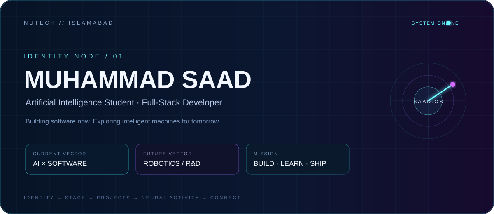
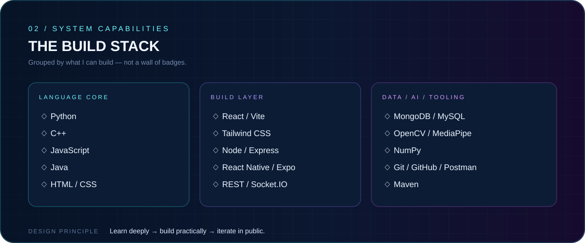
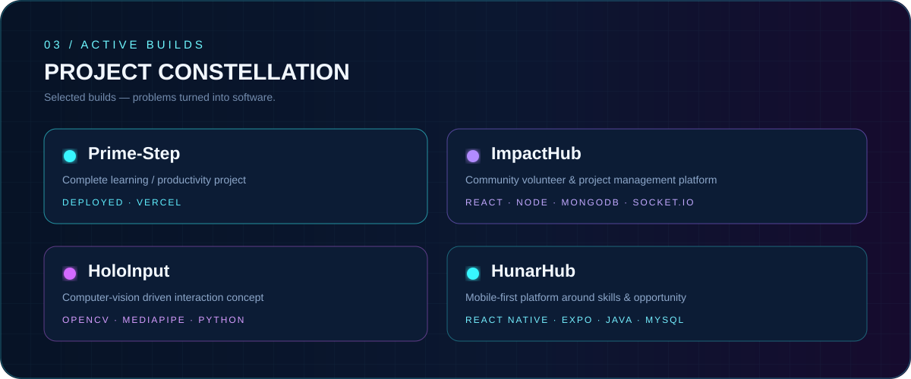
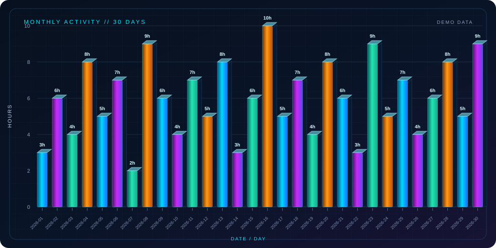
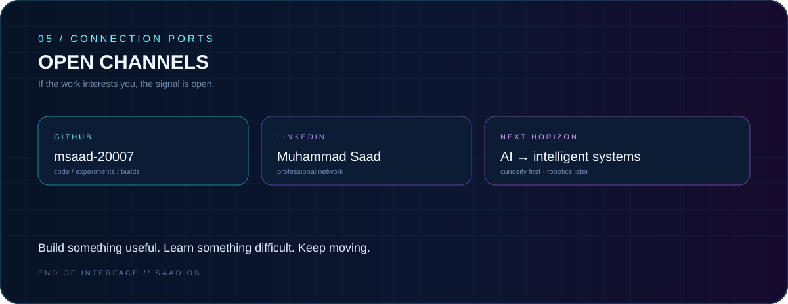

## ◈ Direct channels
- GitHub: [@msaad-20007](https://github.com/msaad-20007)
- LinkedIn: [Muhammad Saad](https://www.linkedin.com/in/muhammad-saad-ai)

> AI student. Full-stack builder. Curious about what happens when software becomes intelligent.
