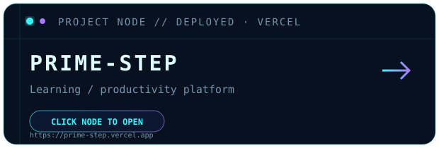
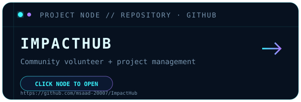
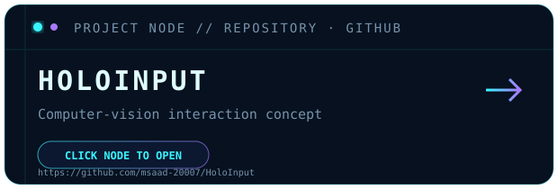
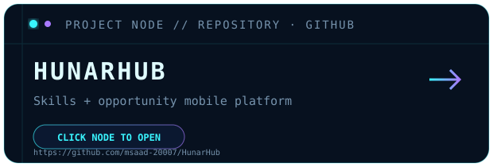
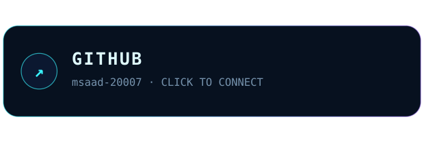
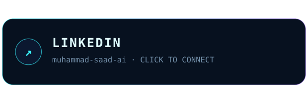

## ◈ PROJECT NODES

<table width="100%">
<tr>
<td align="center" width="50%">

 <b><a href="https://prime-step.vercel.app">▶ OPEN LIVE DEMO</a></b> &nbsp; · &nbsp; <a href="https://github.com/msaad-20007/Prime-Step">SOURCE</a>
</td>
<td align="center" width="50%">

 <b><a href="https://github.com/msaad-20007/ImpactHub">▶ OPEN REPOSITORY</a></b>
</td>
</tr>
<tr>
<td align="center" width="50%">

 <b><a href="https://github.com/msaad-20007/HoloInput">▶ OPEN REPOSITORY</a></b>
</td>
<td align="center" width="50%">

 <b><a href="https://github.com/msaad-20007/HunarHub">▶ OPEN REPOSITORY</a></b>
</td>
</tr>
</table>

**[↗ OPEN NATIVE GITHUB CONTRIBUTION HISTORY](https://github.com/msaad-20007?tab=overview#js-contribution-activity)**

<table width="100%">
<tr>
<td align="center" width="50%"></td>
<td align="center" width="50%"></td>
</tr>
</table>

> AI student. Full-stack builder. Building software now; exploring intelligent machines for tomorrow.

