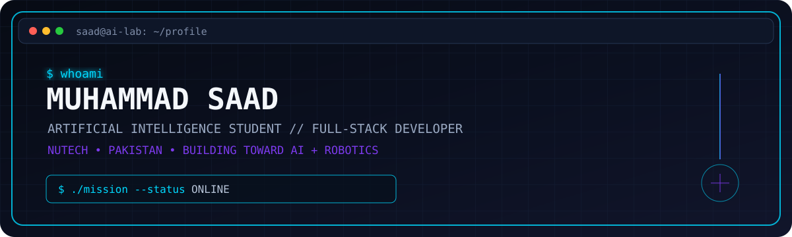
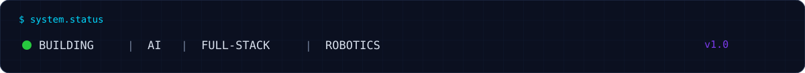
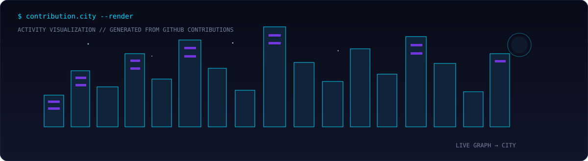

<div align="center">



<br>

<a href="https://github.com/msaad-20007">
  
</a>

<br>

### `BUILD → LEARN → EXPERIMENT → REPEAT`

**Artificial Intelligence Student · Full-Stack Developer · AI & Robotics Explorer**

<p>
  <a href="https://github.com/msaad-20007"></a>
  <a href="https://www.linkedin.com/in/muhammad-saad-ai"></a>
  <a href="https://prime-step.vercel.app"></a>
</p>

</div>

---

## `> whoami`

I'm **Muhammad Saad**, a BS Artificial Intelligence student at **NUTECH** who enjoys turning ideas into working software.

My current path sits at the intersection of:

- 🤖 **Artificial Intelligence & future robotics**
- 🌐 **Full-stack web development**
- 🧠 **Python, C++ & problem solving**
- ⚙️ **Software engineering and real-world projects**
- 🚀 **Building, deploying and continuously improving products**

I don't want to only learn technologies. I want to **build with them**.

---

## `> current_mission`

```text
[ ACTIVE ]

01  Strengthen AI + Python foundations
02  Master Data Structures & Algorithms
03  Build production-quality full-stack applications
04  Explore computer vision + robotics
05  Turn experiments into useful products

SYSTEM STATUS: ONLINE
```

---

## `> tech_stack`

### Languages
`Python` · `C++` · `JavaScript` · `Java` · `HTML` · `CSS`

### Frontend
`React` · `Vite` · `Tailwind CSS` · `React Native` · `Expo`

### Backend
`Node.js` · `Express.js` · `REST APIs` · `Socket.IO`

### Data & Tools
`MongoDB` · `MySQL` · `Git` · `GitHub` · `Postman` · `Maven`

### AI / Computer Vision
`Python` · `OpenCV` · `MediaPipe` · `NumPy`

---

## `> featured_projects`

<table>
<tr>
<td width="50%" valign="top">

### 🧩 Prime-Step

**A deployed full-stack web project.**

- 🌐 Live on Vercel
- ⚡ React/Vite frontend
- 🔧 Separate client/server structure
- 🚀 Currently being improved

<a href="https://github.com/msaad-20007/Prime-Step">Repository →</a>  
<a href="https://prime-step.vercel.app">Live Demo →</a>

</td>
<td width="50%" valign="top">

### 🌍 ImpactHub

**Community volunteer & project management platform.**

- 👥 Multi-role system
- 📋 Kanban task workflow
- ⚡ Real-time Socket.IO features
- 🏆 Impact score & leaderboard
- 🔐 JWT authentication
- 🗄️ MongoDB + Express backend

<a href="https://github.com/msaad-20007/ImpactHub">Explore project →</a>

</td>
</tr>

<tr>
<td width="50%" valign="top">

### 🛠️ HunarHub

**Local service hiring platform for Pakistani workers.**

- 📱 React Native + Expo
- ☕ Java backend
- 🗄️ MySQL + JDBC
- 💬 Real-time chat
- 👤 Customer / Worker / Admin flows
- 📧 Email notifications

<a href="https://github.com/msaad-20007/HunarHub">Explore project →</a>

</td>
<td width="50%" valign="top">

### 🖐️ HoloInput

**Hand-gesture computer control system.**

- 📷 Android phone as camera
- 👁️ OpenCV + MediaPipe
- 🐍 Python vision engine
- ☕ JavaFX desktop application
- 🔌 WebSocket communication
- 🖱️ Gesture-based control roadmap

<a href="https://github.com/msaad-20007/HoloInput">Explore project →</a>

</td>
</tr>
</table>

---

## `> contribution_city`

<p align="center">
  
</p>

<p align="center">
  <sub>This skyline is generated from my GitHub contribution activity.</sub>
</p>

---

## `> github_metrics`

<p align="center">
  
  
</p>

---

## `> activity`

<p align="center">
  
</p>

---

## `> learning_log`

```text
NOW LEARNING
├── Data Structures & Algorithms
├── Python for AI
├── Machine Learning foundations
├── Full-stack engineering
└── Computer Vision / Robotics

NEXT
└── Build → deploy → iterate
```

---

## `> connect`

<p align="center">

<a href="https://www.linkedin.com/in/muhammad-saad-ai">
  
</a>
&nbsp;
<a href="https://github.com/msaad-20007">
  
</a>
&nbsp;
<a href="https://prime-step.vercel.app">
  
</a>

</p>

<div align="center">

```text
╔════════════════════════════════════════════════════════════╗
║  "The future belongs to those who build it."              ║
║                                                            ║
║  Muhammad Saad  //  AI × Software × Robotics              ║
╚════════════════════════════════════════════════════════════╝
```

</div>
